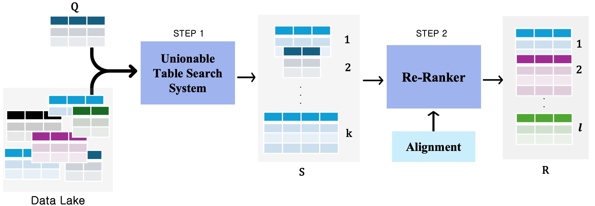

# Novel Table Search (NTS) 

We propose a novelty-aware table search framework that improves the discovery of unionable tables. In addition, we introduce two new evaluation metrics designed to better capture the effectiveness of novel table discovery.



## Overview
The code base contain 6 classes each correspond to one of the systems:
1. ANTs: Penalized_search.py
2. GMC: GMC_search.py
3. Stamire: test_naive_search_export.py
4. SemNov: Semantic_Novelty_search.py
5. StarmieGold: StarmieO_search.py
6. StarmieOne: Starmie1_search.py

We also include the code developed to construct the tailored datasets. 


## Datasets
Datasets and different datarepresenations and ground truth is shared in this link: 


## Extedned Version of Paper


## Dependencies


## Citation

If you use this code in your research, please cite:
```

```
